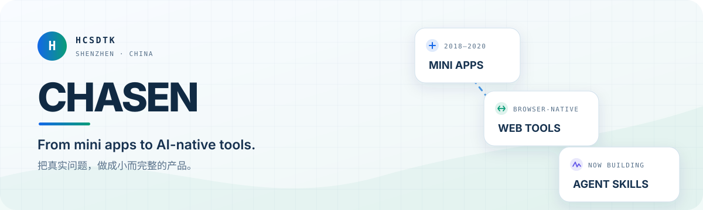

<p align="center">
  <picture>
    <source media="(prefers-color-scheme: dark)" srcset="./assets/profile-banner-dark.svg">
    <source media="(prefers-color-scheme: light)" srcset="./assets/profile-banner-light.svg">
    
  </picture>
</p>

<p align="center">
  <a href="#正在做的事">正在做的事</a> ·
  <a href="#代表作品">代表作品</a> ·
  <a href="#从哪里来">从哪里来</a> ·
  <a href="#一起做点什么">联系我</a>
</p>

## 你好，我是 Chasen 👋

一名在深圳工作的开发者。过去专注微信小程序与前端工程化，现在把更多精力放在 **AI Agent、内容工作流和本地优先的创作工具** 上。

我喜欢从一个具体、真实的问题出发，把它做成小而完整的产品：能运行、能交付，也能被别人继续使用和改造。

> I think, so I am. 更重要的是：I build, so ideas become real.

## 正在做的事

- 把复杂的内容生产流程封装成可复用、可验证的 Agent Skill
- 探索 AI 与图像、视频、写作等创作场景的产品结合
- 构建数据留在本地、打开浏览器就能用的轻量工具
- 持续关注 Agent 工程、上下文工程与人机协作的新范式

## 代表作品

| 项目 | 它解决什么问题 | 关键词 |
| --- | --- | --- |
| **[小说公众号成稿机](https://github.com/hcsdtk/novel-to-wechat)** | 把中文短篇小说自动变成带封面、情节插图和排版的公众号成稿，并支持 Codex、Claude Code 等多种智能体 | Python · Agent Skill · Image Generation |
| **[切界](https://github.com/hcsdtk/qiejie-line-slice)** | 在浏览器里画线分割图片，批量导出透明 PNG；图片全程不离开本机 | TypeScript · React · Canvas |
| **[weup](https://github.com/hcsdtk/weup)** | 在不改变原生开发方式的前提下，为微信小程序补上 mixin、状态管理与事件总线 | JavaScript · WeChat Mini Program |
| **[quick-mpx](https://github.com/hcsdtk/quick-mpx)** | 快速搭建商城类小程序的工程起点 | JavaScript · MPX · Mini Program |
| **[PhotoCoach AI](https://github.com/hcsdtk/photo-coach-ai)** | 用 AI 从构图、姿势、角度和表情等维度提供更直观的拍照指导 | AI Product · Photography |

## 从哪里来

```text
微信小程序与前端工程化
        ↓
浏览器里的图像与创作工具
        ↓
AI Agent、Skill 与可交付的内容工作流
```

技术会变，但我一直在做同一件事：**减少重复劳动，让工具更接近人的真实工作方式。**

## 一起做点什么

如果你也在研究 AI Agent、创作工具、小程序或独立产品，欢迎通过 [GitHub Issues](https://github.com/hcsdtk/hcsdtk/issues) 和我交流，也可以直接从上面的项目开始。

<p align="center">
  <sub>Based in Shenzhen · Building in public on GitHub</sub>
</p>
